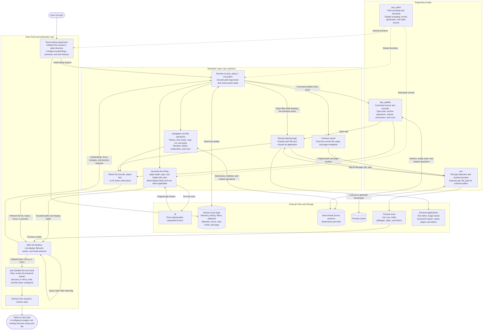

# ipre Architecture and Execution Flow

The core flow is simple: **`ipre` starts fzf; fzf invokes the backend in response
to user actions; the backend reads and updates state, performs file operations,
and calls `pre` to generate previews.**

## Execution Flow

The following Mermaid source describes the main components and their interactions.



Solid arrows represent calls, data flow, or execution flow. Dotted arrows
represent shared-function dependencies.

## Script Responsibilities

| Script         | Responsibility                                                                                                                          |
|----------------|-----------------------------------------------------------------------------------------------------------------------------------------|
| `ipre`         | Program entry point. Parses arguments, initializes session state, configures fzf keybindings, and handles exit and cleanup.             |
| `ipre_backend` | Core operation layer. Generates listings and handles navigation, file operations, preview control, and shared opening logic.            |
| `ipre_palette` | Command palette module loaded by the backend. Provides menus, prompts, and their associated operations.                                 |
| `ipre_paths`   | Shared library loaded by the entry point and backend. Implements the path protocol, display escaping, and part of the state management. |
| `pre`          | Standalone preview program. Also provides file type detection to the backend through `pre get_file_type`.                               |

## Four Key Operating Principles

### 1. fzf Drives Interaction; the Backend Runs on Demand

The backend is not a persistent service. fzf keybindings, preview requests, and
interface events launch the corresponding backend invocations.

These invocations use exported environment variables to locate **the same
session's state files**, preserving the current directory, clipboard, history,
and other state between calls.

### 2. Search and Directory Scanning Are Separate Steps

- **fd** scans the filesystem and produces candidate paths.
- **fzf** performs filename searches over the available candidates.
- Navigation and changes to depth or filtering rules trigger listing regeneration
  through the configured bindings.
- `depth=0` streams listing results without waiting for a global sort.

### 3. Operation Paths Are Separate from Display Content

The current listing record formats are:

```text
Compact:  encoded_absolute_path<TAB>display_name
Detailed: encoded_absolute_path<TAB>display_name<TAB>attributes<TAB>link_suffix
```

In detailed mode, fzf rearranges the visible fields:

```text
attributes → name → link suffix
```

**File operations always use the encoded path in the first field.** Icons,
column widths, `->` text, and display order do not change the actual operation
target.

### 4. Previewing and Opening Share File Type Detection

`pre` detects file types, invokes preview tools, and manages the thumbnail cache.
The backend manages page numbers and preview refreshes.

When opening files, the backend also calls `pre get_file_type`, then selects the
appropriate application. This function currently **checks known extensions first
and falls back to MIME detection for other cases**.
