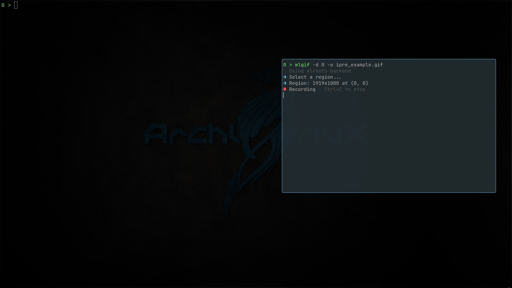

# Example



# Dependency
The following programs are required by the `pre` command:

1. `chafa`    - print image in terminal(the kernel)
2. `eza`      - preview directory
3. `bat`      - preview text/source files
4. `pdftoppm` - preview pdf files
5. `ddjvu`    - preview djvu files
6. `magick`   - preview fonts
7. `ffmpegthumbnailer`      - preview videos
8. `archivemount/fuse-zip`  - preview tar(.gz) or zip files
9. `gnome-epub-thumbnailer` - preview EPub or MOBI books

To make `chafa` work, your terminal must support the `sixel` protocol, and your shell must be `Zsh`.


# Usage
Add this script to your `PATH`.

## basic
Provide a filename as an argument like this:
```shell
$ pre test.pdf
$ pre test.mp4
$ pre test.png
$ pre times.ttf
$ pre test.epub
```

## play with fzf
Add the following script to your `.zshrc`:

```bash
function ipre() {
    local cmd file
    if [[ -n "$IPRE_LS" ]]; then
        cmd=(${=IPRE_LS})
    else
        cmd=(
            fd --hidden --follow
            -E .git
            -E target
            -E .cargo
            -E build
            -E .npm
            -E node_modules
            -E .cache
            -E dist
            -E out
            -E lsp-bridge
            # other ignore dir
            -E .java
            -E .gradle
            -E .nuget
            -E .steam
            -E .android
            -E .ipython
            -E .vscode
            -E .vscode-oss
            -E .oh-my-zsh
            -E .emacs-tmp
            -E .pub-cache
            -E .proxyman
            . # search all patterns
            )
    fi
    if [[ $# -gt 0 ]]; then
        cmd+=("$@")
    fi
    # file select and preview
    cmd_str=$(printf '%q ' "${cmd[@]}")
    # merge with fzf
    FZF_STATE_FILE="$HOME/.cache/pre_thumbs/fzf_state"
    echo "file" > "$FZF_STATE_FILE"
    file=$(
        "${cmd[@]}" | fzf \
        --multi \
        --prompt "ipre > " \
        --preview 'pre {}' \
        --height=50% --reverse \
        --preview-window=right:60% \
        --bind 'resize:refresh-preview' \
        --bind 'focus,load:transform-header:file --brief {}' \
        --bind "\`:reload(\
               if grep -qxF 'file' '$FZF_STATE_FILE'; then \
                   echo 'directory' > '$FZF_STATE_FILE' && \
                   $cmd_str --type f $dir; \
               elif grep -qxF 'directory' '$FZF_STATE_FILE'; then \
                   echo 'all' > '$FZF_STATE_FILE' && \
                   $cmd_str --type d $dir; \
               else \
                   echo 'file' > '$FZF_STATE_FILE' && \
                   $cmd_str $dir; \
               fi)" \
        --bind 'alt-a:select-all' \
        --bind 'alt-a:+execute-silent(echo {+} | wl-copy)' \
        --bind 'alt-y:execute-silent(echo {} | wl-copy)' \
        --bind "alt-r:execute-silent(rm -f {})+reload($cmd_str)" \
        --bind "alt-left:reload($cmd_str $dir)" \
        --bind "alt-right:reload(\
               if [[ -d '{}' ]]; then \
                  $cmd_str {}; \
               else \
                  $cmd_str \$(dirname {}); \
               fi)"
        )
    # post action for selection:
    [[ -z "$file" ]] && return
    if [[ -d "$file" ]]; then
        cd "$file"
        return
    fi
    case "${file:l}" in
        *.png|*.jpg|*.jpeg|*.gif|*.webp|*.bmp|*.tiff)
            nohup imv "$file" &>/dev/null &
            ;;
        *.pdf|*.djvu|*.epub|*.mobi)
            nohup zathura "$file" &>/dev/null &
            ;;
        *.tar|*.tar.gz|*.tgz|*.tar.xz|*.txz|*.tar.bz2|*.tbz2)
            return
            ;;
        *.zip)
            return
            ;;
        # for text files to open:
        *)
            ${EDITOR:-nvim} "$file"
            ;;
    esac
}
```


To use this function, install the following:

1. `fd/fzf`   - the kernel
2. `imv`      - open image
3. `zathura`  - open pdf
4. `nvim`     - the text editor

Using examples:

```shell
ipre                  # search current directory
ipre <dir>            # search dir
ipre <dir_1> ... <dir_n>  # search all of these directories together 
```


Notes:

* set `IPRE_LS` to change the default search method;
* set `EDITOR` to change the default text file opener command;
* you may need to replace `wl-copy` with your own clipboard program;


# Config
Configure this program by environment variables. 

* set `EZA_ARG` to change the default argument of `eza`;
* set `FONT_TEXT` to change the sample text in font-preview.


# WARNING

* if pdf-preview does NOT work, clean the folder `~/.cache/pre_thumbs`.
* before clear the cache folder `~/.cache/pre_thumbs`, run `umount ~/.cache/pre_thumbs/mnt` first !!!
