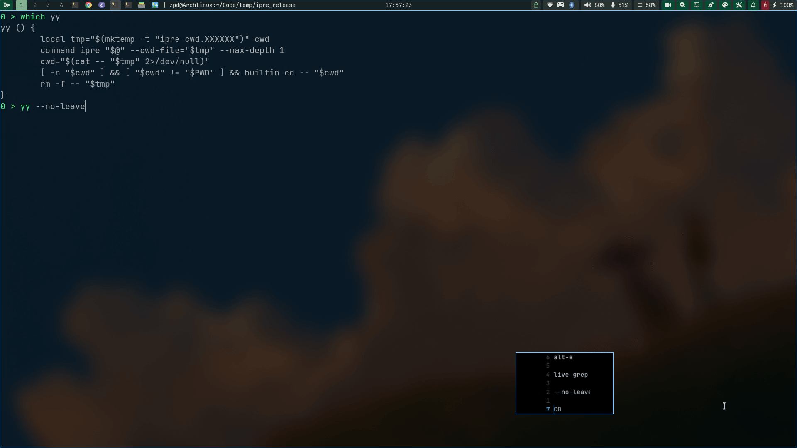

## Examples

Basic Example:


Advanced Example:


NOTE: these GIFs might be out of date.

## WARN
To use these scripts, you MUST use `zshell`.

## Dependency
The following programs are required by the `pre` command:

1. `chafa`    - print image in terminal(the kernel)
2. `eza`      - preview directory
3. `bat`      - preview text/source files
4. `pdftoppm` - preview pdf files(`pdfinfo` for page counting)
5. `ddjvu`    - preview djvu files(`djvused` for page counting)
6. `magick`   - preview fonts
7. `ffmpegthumbnailer`      - preview videos
8. `archivemount/fuse-zip`  - preview tar(.gz) or zip files
9. `gnome-epub-thumbnailer` - preview EPub or MOBI books

NOTE: For `chafa` to work, your terminal may need to support the `sixel` protocol.

## Usage
Add this script to your `PATH`.

## Basic
Provide a filename as an argument like this:
```shell
# view page 1 in test.pdf
$ pre test.pdf
# view page 4 in test.pdf/test.djvu
$ pre test.pdf 4
$ pre test.djvu 4

$ pre test.mp4
$ pre test.png
$ pre times.ttf
$ pre test.epub
```

## Config
Configure this program by environment variables. 

* set `EZA_ARG` to change the default argument of `eza`;
* set `FONT_TEXT` to change the sample text in font-preview.

## Play with (z)shell
Add the scripts - `pre`, `ipre`, `ipre_backend` and `ipre_palette` to your PATH, and then add the following config to your `.zshrc`:

```shell
# inline (file) preview in shell
function ipre() {
    local tmp="$(mktemp -t "ipre-cwd.XXXXXX")" cwd
    command ipre "$@" --cwd-file="$tmp"
    cwd="$(cat -- "$tmp" 2>/dev/null)"
    [ -n "$cwd" ] && [ "$cwd" != "$PWD" ] && builtin cd -- "$cwd"
    rm -f -- "$tmp"
}
# '--no-leave' argument will break directory changing of RET.
function yy() {
    local tmp="$(mktemp -t "ipre-cwd.XXXXXX")" cwd
    command ipre "$@" --cwd-file="$tmp" --depth 1
    cwd="$(cat -- "$tmp" 2>/dev/null)"
    [ -n "$cwd" ] && [ "$cwd" != "$PWD" ] && builtin cd -- "$cwd"
    rm -f -- "$tmp"
}
```

This function depends on the following stuff:

1. `fd/fzf`   - the kernel
2. `du`       - show file size
3. `imv`      - open image
4. `zathura`  - open pdf
5. `nvim`     - the text editor
6. `wl-copy`  - clipboard support
7. `awk/sed/grep` - as it is
8. `tr/cut/wc/head/tail` - as it is
9. `ripgrep/ast-grep` - better grep
10. zshell / bash builtin

Using examples:

```shell
ipre                      # search current directory
ipre <dir>                # search dir
ipre <dir_1> ... <dir_n>  # search all of these directories together 

# add more filter to fd
ipre -e c <dir>           # select files with extension '.c'
ipre <dir> --maxdepth 1   # perform likes yazi
```

Keybinds:

```txt
=== ipre Keybindings ===
  Ctrl+q             : Exit ipre
  Alt+q              : Exit and CD to current viewed dir
  Enter              : Open file/directory
  [Left/Right]       : Navigate parent/child directories
  Alt+[f/b]          : Preview window Scroll up/down
  `(Backtick)        : Toggle File/Directory/All view
  Alt+p              : Toggle preview window
  Alt+.              : Toggle hidden files
  Alt+[0~9]          : Set search depth (0 for infinite)
  Alt+[-/=]          : Decrease/Increase search depth
  Alt+o              : Cycle sort mode (name/time/size/ext)
  Alt+g              : Live Grep (Search file content)
  Alt+a              : Toggle selection (Invert)
  Alt+y              : Copy path(s) to clipboard
  Alt+[c/x/v]        : Copy/Cut/Paste files
  Alt+i              : Inspect ipre select|clip system
  Alt+s              : Cross-directory multi-selection
  Alt+r              : Rename selected item(s) |Use Ripgrep in live grep
  Alt+f              : Preview window Scroll up|Use Fuzzy in live grep
  Alt+w              : Wdired batch rename(UNSAFE)
  Alt+n              : Create new file/directory
  Alt+d              : Delete selected
  Alt+m              : Bookmark selected items
  Alt+/              : Open bookmarks menu
  Alt+;              : Global Search & Replace[rg](by nvim & grug-far.nvim)
  Alt+'              : Global Search & Replace[ast-rg](by nvim & grug-far.nvim)
  Alt+?              : Show this help
  Alt+t              : To directory by Zoxide
  Alt+Space          : Open command pallete
```

Notes:

* set `IPRE_FD` to change the default search method;
* set `EDITOR` to change the default text file opener command;
* set `CLIPBOARD` to change the default clipboard program;
* to use `live grep`(`alt-g`), you need to install `ripgrep`.
* to use `global search & replace`(`alt-;` or `alt-'`), you need to install `ripgrep` and `ast-grep`.

For example, add `.git` filter to `IPRE_FD`:

```shell
export IPRE_FD='fd --follow -I . -E .git'
```

## WARNING

* if pdf-preview does NOT work, clean the folder `~/.cache/pre_thumbs`.
* before clear the cache folder `~/.cache/pre_thumbs`, run `umount ~/.cache/pre_thumbs/mnt` first !!!
