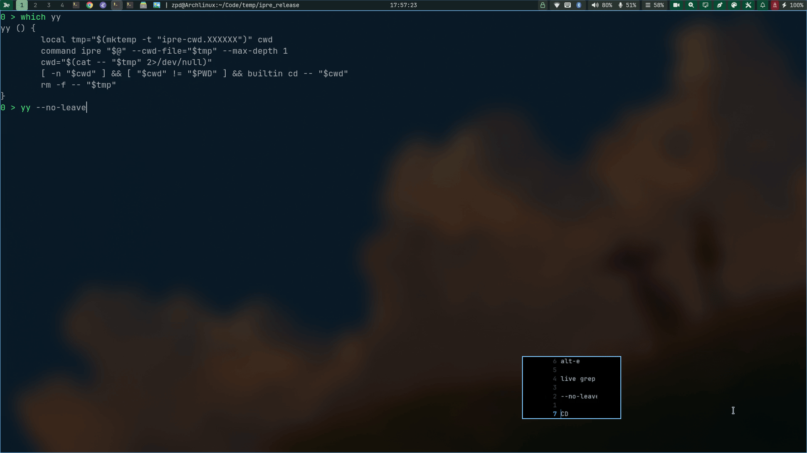

# ipre

A terminal file browser built with **zsh, fzf, and fd**, with content previews
provided by `pre`.

- Browse directories with fuzzy search, navigation history, and detailed listings.
- Preview text, images, documents, videos, fonts, and archive contents.
- Copy, move, rename, delete, and restore files, including names with special characters.
- Keep selections across directories and choose applications from a command palette.
- Run multiple sessions with independent navigation and clipboard state.

## Contents

- [Requirements](#requirements)
- [Setup](#setup)
- [Usage](#usage)
- [Keybindings](#keybindings)
- [Browsing and file operations](#browsing-and-file-operations)
- [Opening files](#opening-files)
- [Configuration](#configuration)
- [Storage and troubleshooting](#storage-and-troubleshooting)
- [Project structure and tests](#project-structure-and-tests)
- [Examples](#examples)

## Requirements

The scripts use zsh and Linux/GNU command-line tools. Core dependencies are
`zsh`, `bash`, `fzf`, `fd`, `file`, GNU coreutils, and standard text tools such as
`awk`, `sed`, and `grep`.

Use fzf with support for `--id-nth`, `reload-sync`, and dynamic field transforms.
The current interface has been tested with **fzf 0.74.4**. Install the additional
tools below for the features you use.

### Preview tools

| Content                          | Tools                                           |
|----------------------------------|-------------------------------------------------|
| Text and source code             | `bat`; falls back to `head`                     |
| Directories                      | `eza`                                           |
| Images and generated thumbnails  | `chafa`                                         |
| PDF                              | `pdftoppm`, `pdfinfo`                           |
| DjVu                             | `ddjvu`, `djvused`                              |
| PPM images and fonts             | ImageMagick (`magick`)                          |
| Video thumbnails                 | `ffmpegthumbnailer`                             |
| EPUB / MOBI thumbnails           | `gnome-epub-thumbnailer`                        |
| ZIP contents                     | `fuse-zip`, `eza`, and working FUSE support     |
| Other supported archive contents | `archivemount`, `eza`, and working FUSE support |

Image previews currently use chafa's **Sixel** output, so the terminal must
support Sixel. File icons also need a compatible font, such as a Nerd Font.

### Optional integrations

| Feature                             | Tools                                                                        |
|-------------------------------------|------------------------------------------------------------------------------|
| Copy paths to the system clipboard  | `wl-copy`, or the program configured by `CLIPBOARD`                          |
| Live content search                 | ripgrep (`rg`)                                                               |
| Directory jumps                     | `zoxide`                                                                     |
| Global search and replace           | Neovim with `grug-far.nvim`, plus `rg` or `ast-grep` for the selected engine |
| Archive creation and extraction     | `tar`, `zip`, `unzip`, and the relevant compression tools                    |
| Git operations                      | `git`                                                                        |
| Open files in external applications | See [Opening files](#opening-files)                                          |

## Setup

Keep these five files together in a directory on your `PATH`:

```text
ipre
ipre_backend
ipre_palette
ipre_paths
pre
```

For example, add the repository directory to `PATH` in your `.zshrc`:

```zsh
export PATH="/path/to/ipre:$PATH"
```

Ensure `ipre`, `ipre_backend`, and `pre` are executable.

### Change the shell directory on exit

An external program cannot change its parent shell's working directory. Add this
optional wrapper to `.zshrc` to apply the directory written by `--cwd-file`:

```zsh
function ipre() {
    local tmp cwd result
    tmp=$(mktemp -t ipre-cwd.XXXXXX) || return
    command ipre "$@" --cwd-file="$tmp"
    result=$?
    # Read through EOF, preserving spaces and trailing newlines in the path.
    IFS= read -r -d '' cwd < "$tmp" || true
    rm -f -- "$tmp"
    if [[ -n "$cwd" && "$cwd" != "$PWD" ]]; then
        builtin cd -- "$cwd" || return
    fi
    return "$result"
}
```

With this wrapper, `Alt+q` exits into the currently viewed directory. In the
default mode, accepting a single directory with `Enter` exits into that directory.
With `--keep-open`, use `Right` to navigate and `Alt+q` to exit into the current
directory; `Enter` on a directory leaves the browser open.

## Usage

### Browse files

```zsh
ipre                          # Browse the current directory
ipre /path/to/directory        # Browse one directory
ipre /path/one /path/two       # Search several directories together
ipre --depth 3                 # Include entries up to three levels deep
ipre --depth 0                 # Stream results without a depth limit
ipre -e c /path/to/project     # Pass an extension filter to fd
ipre --keep-open               # Keep the browser open after opening files
```

| Option                  | Meaning                                                        |
|-------------------------|----------------------------------------------------------------|
| `--depth N`             | Search depth; defaults to `1`. `0` means unlimited.            |
| `-d N`, `--max-depth N` | Aliases for `--depth N`.                                       |
| `--keep-open`           | Open files without closing the main browser.                   |
| `--stay`, `--no-leave`  | Aliases for `--keep-open`.                                     |
| `--cwd-file=PATH`       | Write the chosen exit directory to a file for a shell wrapper. |

`--depth=N` and `--max-depth=N` are also accepted. Additional options are passed
to fd. Hidden files are shown initially; `Alt+.` toggles them. The default fd
command ignores `.gitignore` rules and follows symbolic links.

### Preview a file directly

```zsh
pre report.pdf                # Preview the first page
pre report.pdf 4              # Preview page 4
pre book.djvu 4
pre image.png
pre video.mp4
pre font.ttf
pre book.epub
pre get_file_type report.pdf  # Print the detected type without rendering
```

## Keybindings

### Navigation and display

| Key               | Action                                                                         |
|-------------------|--------------------------------------------------------------------------------|
| `Ctrl+q`          | Exit without requesting a shell directory change                               |
| `Alt+q`           | Exit into the viewed directory when using the shell wrapper                    |
| `Enter`           | Accept files or a directory; see [Setup](#setup) for directory behavior        |
| `Left` / `Right`  | Navigate to the parent / selected directory; Right on a file visits its parent |
| `F2` / `F3`       | Go back / forward in directory history                                         |
| `Alt+e`           | Toggle compact / detailed listing                                              |
| Backtick          | Cycle all / files / directories                                                |
| `Alt+.`           | Toggle hidden files                                                            |
| `Alt+0` … `Alt+9` | Set search depth; `0` means unlimited                                          |
| `Alt+-` / `Alt+=` | Decrease / increase search depth                                               |
| `Alt+o`           | Cycle sorting by name / time / size / extension                                |
| `Alt+p`           | Toggle the preview pane                                                        |
| `Alt+f` / `Alt+b` | Next / previous PDF or DjVu page; otherwise scroll the preview down / up       |
| `Alt+?`           | Show built-in help                                                             |

### Selection and file operations

| Key                         | Action                                                    |
|-----------------------------|-----------------------------------------------------------|
| `Tab` / `Shift+Tab`         | Toggle an item and move down / up                         |
| `Alt+a`                     | Toggle selection of all matching items                    |
| `Alt+s`                     | Save items in the cross-directory selection buffer        |
| `Alt+i`                     | Inspect and edit the selection and file clipboard buffers |
| `Alt+c` / `Alt+x` / `Alt+v` | Copy / cut / paste files                                  |
| `Alt+y`                     | Copy absolute paths to the system clipboard               |
| `Alt+r`                     | Rename selected items interactively                       |
| `Alt+w`                     | Edit selected names together in the batch rename editor   |
| `Alt+n`                     | Create a file or directory                                |
| `Alt+d`                     | Move selected items to the trash                          |
| `Alt+m`                     | Bookmark selected items                                   |
| `Alt+/`                     | Open bookmarks                                            |
| `Alt++`                     | Diff exactly two files from the saved selection buffer    |

### Search and commands

| Key         | Action                                 |
|-------------|----------------------------------------|
| `Alt+g`     | Search file contents with ripgrep      |
| `Alt+t`     | Jump to a directory using zoxide       |
| `Alt+;`     | Open grug-far with the ripgrep engine  |
| `Alt+'`     | Open grug-far with the ast-grep engine |
| `Alt+Space` | Open the command palette               |

Inside the live grep picker, `Alt+f` switches to fuzzy filtering and `Alt+r`
returns to ripgrep search. `Ctrl+f` / `Ctrl+b` scroll its preview.

The command palette provides **Open with...**, system-default opening, archive
creation and extraction, executable permissions, shell commands, Git staging,
checksums, trash restoration, and trash emptying.

## Browsing and File Operations

### History and detailed listings

`F2` / `F3` traverse directories visited in this session, including bookmark,
live grep, and zoxide jumps. A new visit after going back clears forward history.
Missing or inaccessible directories are skipped. History navigation clears the
query, file/directory filter, and explicit search roots; it retains depth, sorting,
clipboard contents, and the saved selection.

`Alt+e` displays attributes before filenames, similar to `ls -l`:

```text
type  permissions  size  modification time  name [-> symlink target]
```

Attribute columns have fixed widths. Permissions are octal, sizes are in bytes,
and directory sizes appear as `-` without calculating recursive disk usage.
Detailed mode disables automatic horizontal scrolling to keep columns aligned.
Full names remain searchable beyond the visible width; metadata and link targets
are excluded from filename search. Switching views preserves focus and multi-selection.

Depth `0` streams results without global sorting or icons. Other depths apply the
selected sort order and place directories first.

### Copy, cut, and paste

Paste focuses the first successful destination. Successful moves are removed
from the cut buffer; failed items remain available for retry. Copy retains its
buffer. Failures appear as `Paste: N failed` in the header.

Copying or moving a directory into itself or a descendant is rejected, including
through directory symlinks. A failed copy may leave partial destination content;
that destination is not treated as a successful focus target.

### Rename

Edited names are relative to each selected item's parent directory. Renaming
`/a/b/c.txt` to `new.txt` produces `/a/b/new.txt`; entering `../new.txt` moves it
to `/a/new.txt`.

Batch rename rows contain a fixed `[id]`, a TAB, and an editable name. Keep the
IDs intact, and rename a directory and its children in separate batches. Batch
moves use temporary paths beside the sources and attempt rollback on failure.

Names containing arrows, percent signs, TAB, newlines, and non-UTF-8 bytes are
kept separate from their display labels. Name editors use `\n` for newline,
`\t` for TAB, and `\\` for a literal backslash. See the
[path protocol](./PATH_PROTOCOL.md) for details.

### Trash and restore

Deleted items are stored separately, so matching names do not overwrite one
another. **Restore files from trash** in the command palette returns items to
their original directories and recreates missing parents. Existing destinations
are preserved by adding `_restoredN` to restored names. The restore menu shows
the original paths.

## Opening Files

Default Enter, `--keep-open`, and the palette share the backend opener. Each
file is classified through `pre get_file_type`, allowing mixed selections to
use different applications. Detection checks known extensions first and uses
MIME for absent or unrecognized extensions; it does not verify every known
extension against file contents.

| File type                | Environment variable   | Default                      |
|--------------------------|------------------------|------------------------------|
| Text                     | `EDITOR`               | `nvim`                       |
| Image / PPM              | `IPRE_IMAGE_OPENER`    | `imv`                        |
| PDF / DjVu / EPUB / MOBI | `IPRE_DOCUMENT_OPENER` | `zathura`                    |
| Audio / video            | `IPRE_MEDIA_OPENER`    | `mpv`                        |
| Other                    | `IPRE_SYSTEM_OPENER`   | `xdg-open` (`open` on macOS) |

Text files open together in a foreground editor. Images and media are grouped
in background applications; document and system handlers receive one file per
process. Missing programs and failed foreground commands report an `Open:` error.
Failures after a background application starts cannot be reported here.

Use `Alt+Space` → **Open with...** to choose a handler explicitly or enter a custom
program with foreground/background execution. Opener specifications accept quoted
program names and arguments, such as `nvim -p` or
`"/path with spaces/viewer" --fullscreen`. Paths are appended as separate arguments;
these specifications do not evaluate pipes, variables, or command substitutions.

## Configuration

Configure the opener variables above and these settings in your shell:

| Variable          | Purpose                                                       |
|-------------------|---------------------------------------------------------------|
| `IPRE_FD`         | Base fd command and arguments; defaults to `fd --follow -I .` |
| `CLIPBOARD`       | System clipboard program for `Alt+y`; defaults to `wl-copy`   |
| `EZA_ARG`         | Arguments for directory and archive previews                  |
| `FONT_TEXT`       | Sample text for font previews                                 |
| `XDG_CACHE_HOME`  | Base cache directory; defaults to `~/.cache`                  |
| `XDG_DATA_HOME`   | Base persistent-data directory; defaults to `~/.local/share`  |
| `XDG_RUNTIME_DIR` | Base session-state directory; falls back to `/dev/shm`        |

```zsh
export IPRE_FD='fd --follow -I . -E .git'
export EDITOR=nvim
export IPRE_IMAGE_OPENER=imv
export IPRE_MEDIA_OPENER=mpv
export CLIPBOARD=wl-copy
export EZA_ARG='-lb --icons=always --color=always'
```

## Storage and Troubleshooting

| Data                                                               | Location                                                       | Lifetime                                           |
|--------------------------------------------------------------------|----------------------------------------------------------------|----------------------------------------------------|
| Navigation, history, filters, buffers, focus, view, and page state | `${XDG_RUNTIME_DIR:-/dev/shm}/ipre_<PID>`                      | Independent per invocation; removed on normal exit |
| Bookmarks                                                          | `${XDG_DATA_HOME:-$HOME/.local/share}/ipre/bookmarks.paths-v1` | Shared across sessions                             |
| Trash                                                              | `${XDG_DATA_HOME:-$HOME/.local/share}/ipre/.trash`             | Shared across sessions                             |
| Preview cache                                                      | `${XDG_CACHE_HOME:-$HOME/.cache}/pre_thumbs`                   | Reused across sessions                             |

Legacy bookmarks are migrated to `bookmarks.paths-v1` on first use. Preview cache
keys include the absolute source path, file identity, nanosecond timestamps, and
rendering options. Standalone `pre` also accepts an `IPRE_CACHE_DIR` override;
`ipre` sets this directory from `XDG_CACHE_HOME`.

- **Blank image or document previews:** check Sixel support and the relevant
  renderer first. If cached thumbnails are damaged, unmount any archive mounted
  under the cache's `mnt` directory before clearing the cache.
- **Alt keys insert accented characters:** configure the terminal to send
  Alt/Option as Meta (an Escape prefix).
- **No shell directory change:** install the wrapper from [Setup](#setup).
- **Detailed columns consume too much space:** hide the preview with `Alt+p`
  or enlarge the terminal.

## Project Structure and Tests

| Script         | Role                                                               |
|----------------|--------------------------------------------------------------------|
| `ipre`         | Startup, session initialization, fzf bindings, and exit handling   |
| `ipre_backend` | Listing, navigation, file operations, preview control, and opening |
| `ipre_palette` | Command menus and their handlers, loaded by the backend            |
| `ipre_paths`   | Shared path encoding, record generation, and state helpers         |
| `pre`          | Standalone preview rendering and file type detection               |

See [Architecture](./ARCHITECTURE.md) for the execution flow and Mermaid diagram,
and [Path protocol](./PATH_PROTOCOL.md) for record and state formats.

```sh
python3 tests/run.py                     # Syntax checks and all regression suites
python3 tests/run.py -k cache            # Tests matching a name
python3 tests/run.py -p test_details.py  # One suite
```

Tests cover real fzf interaction, concurrent sessions, special filenames, file
operation failures, preview caching, and openers. Requirements, isolation, and
coverage are documented in [tests/README.md](./tests/README.md).

## Examples

These recordings may show older keybindings or interface details.

### Basic browsing


### Advanced workflow



## License

See [LICENSE](./LICENSE) for the GNU General Public License, version 3.
